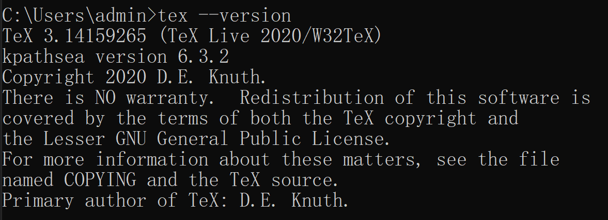

# 2021年美赛工作指南
## latex模板的使用

### 环境安装准备
- 安装texlive发行版
    - 安装地址<https://mirrors.cloud.tencent.com/CTAN/systems/texlive/Images/texlive2020.iso>
    - 下载后得到的iso文件进行解压后，双击 install-tl-windows.bat 进行安装，整个过程大约半个小时
    - 在cmd终端输入tex --version可以看到版本信息，证明安装成功
    
- 安装texstudio编辑器
    - 安装地址<http://texstudio.sourceforge.net>
    - 一路确认完成安装，在桌面创建好快捷方式
    - 界面汉化。初始界面为英文，可以通过菜单栏Options—-Configure TexStudio…—-General—-Language—-zh_CN

### 美赛模板的下载安装
- 模板下载地址
    - 一般是先去美赛官网查看发布的answersheet然后下载，这里我们直接去github上找到开源mcmthesis模板进行下载，这里直接提供zip下载地址<https://github.com/latexstudio-org/mcmthesis/releases/download/6.3.1-2/mcmthesis-demo.zip>
- 解压后直接在文件夹中找到mcmthesis-demo.tex打开即可
- 快速上手美赛latex推荐b站这个视频<https://www.bilibili.com/video/BV1i7411T7zo?from=search&seid=13472774914124945854>
